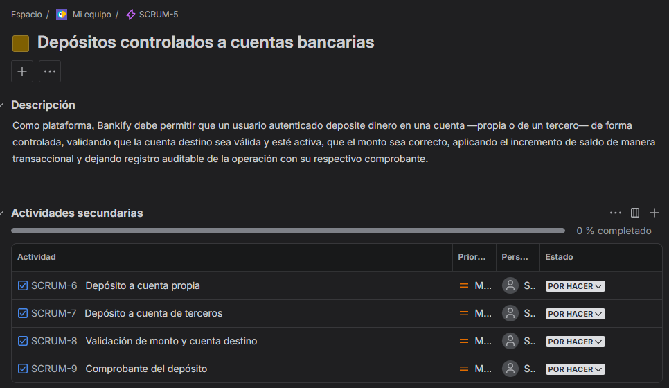
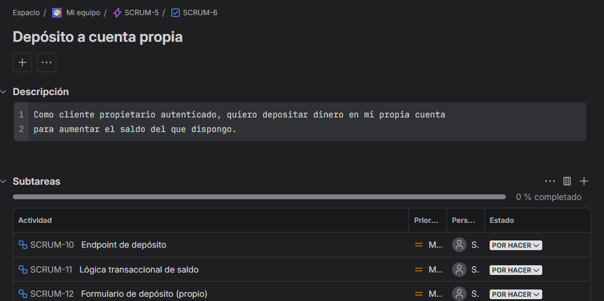
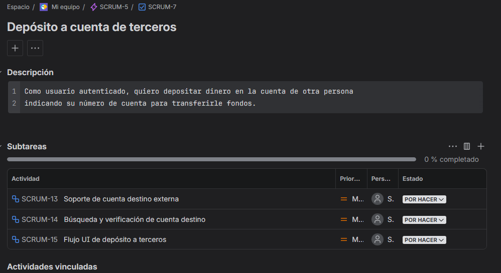
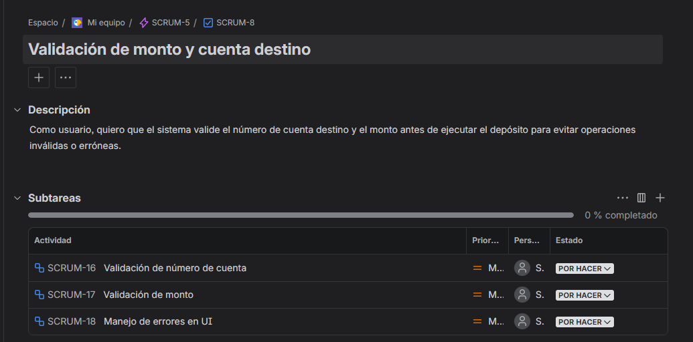
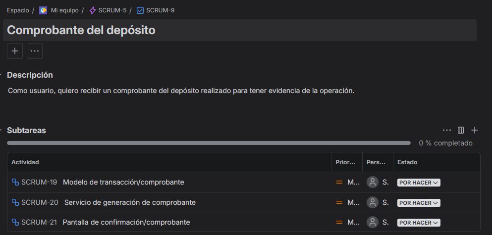

# Evidencias del Product Backlog en Jira — Bankify

> **Documento:** `jira.md` · **Parte 6 — Product Backlog en Jira (20%)**
> **Responsable:** Julian
> **Épica asociada:** Depósitos controlados a cuentas bancarias (`SCRUM-5`)
> **Workspace de Jira:** _(https://904juliancorredor.atlassian.net/browse/SCRUM-5?atlOrigin=eyJpIjoiOTI5MTY4NWViYjY0NDNkNjhjZTc2MjFiNjZlZTVkZWEiLCJwIjoiaiJ9`)_

---

## Nota sobre la jerarquía usada

El proyecto en Jira está configurado con la jerarquía **Épica → Tarea → Subtarea**
(no incluye el tipo "Story"). Por lo tanto, las **historias de usuario** del laboratorio
se crearon como **Tareas** colgando de la épica, y las **tareas técnicas** del
laboratorio se crearon como **Subtareas** dentro de cada historia. La estructura
jerárquica y el contenido cumplen con lo solicitado.

```
Épica SCRUM-5 — Depósitos controlados a cuentas bancarias
 ├── SCRUM-6  Depósito a cuenta propia
 │     ├── SCRUM-10  Endpoint de depósito
 │     ├── SCRUM-11  Lógica transaccional de saldo
 │     └── SCRUM-12  Formulario de depósito (propio)
 ├── SCRUM-7  Depósito a cuenta de terceros
 │     ├── SCRUM-13  Soporte de cuenta destino externa
 │     ├── SCRUM-14  Búsqueda y verificación de cuenta destino
 │     └── SCRUM-15  Flujo UI de depósito a terceros
 ├── SCRUM-8  Validación de monto y cuenta destino
 │     ├── SCRUM-16  Validación de número de cuenta
 │     ├── SCRUM-17  Validación de monto
 │     └── SCRUM-18  Manejo de errores en UI
 └── SCRUM-9  Comprobante del depósito
       ├── SCRUM-19  Modelo de transacción/comprobante
       ├── SCRUM-20  Servicio de generación de comprobante
       └── SCRUM-21  Pantalla de confirmación/comprobante
```


---

## Checklist de la Parte 6

| # | Actividad en Jira | Evidencia | Estado |
|---|-------------------|-----------|:------:|
| 1 | Crear la épica: título, descripción y fecha de vencimiento | Captura de la épica | ☐ |
| 2 | Crear las 4 historias de usuario: título y descripción | Captura de cada historia | ☐ |
| 3 | Crear las 12 tareas: título, descripción y actividades relacionadas | Captura de cada tarea | ☐ |
| 4 | Actualizar `scrum_work_bankify.md` con los IDs de Jira | Archivo actualizado | ☐ |
| 5 | Captura del cronograma/timeline en Jira | Captura del timeline | ☐ |

---

## 1. Épica

| Campo | Valor |
|-------|-------|
| **ID en Jira** | `SCRUM-5` |
| **Tipo** | Epic |
| **Título** | Depósitos controlados a cuentas bancarias |
| **Fecha de vencimiento** | 27 jun 2026 |

**Descripción:**

> Como plataforma, Bankify debe permitir que un usuario autenticado deposite dinero en
> una cuenta —propia o de un tercero— de forma controlada, validando que la cuenta
> destino sea válida y esté activa, que el monto sea correcto, aplicando el incremento
> de saldo de manera transaccional y dejando registro auditable de la operación con su
> respectivo comprobante.



---

## 2. Historias de Usuario

### HU-01 · Depósito a cuenta propia

| Campo | Valor |
|-------|-------|
| **ID en Jira** | `SCRUM-6` |
| **Tipo** | Tarea (hace de Historia) |
| **Épica padre** | `SCRUM-5` |
| **Prioridad** | Alto |

**Descripción:**

> Como cliente propietario autenticado, quiero depositar dinero en mi propia cuenta
> para aumentar el saldo del que dispongo.
>
> **Criterios de aceptación:** el saldo se incrementa exactamente en el monto
> depositado; la operación es transaccional (sin estados parciales ante fallo); el
> cliente recibe confirmación visual; el tiempo de respuesta es menor a 2 segundos.


---

### HU-02 · Depósito a cuenta de terceros

| Campo | Valor |
|-------|-------|
| **ID en Jira** | `SCRUM-7` |
| **Tipo** | Tarea (hace de Historia) |
| **Épica padre** | `SCRUM-5` |
| **Prioridad** | Alto |

**Descripción:**

> Como usuario autenticado, quiero depositar dinero en la cuenta de otra persona
> indicando su número de cuenta para transferirle fondos.
>
> **Criterios de aceptación:** el saldo de la cuenta destino se incrementa en el monto
> indicado; el sistema confirma el banco destino (2 primeros dígitos) antes de procesar;
> no se requiere ser propietario de la cuenta destino; se genera el mismo registro y
> comprobante que en un depósito propio.


---

### HU-03 · Validación de monto y cuenta destino

| Campo | Valor |
|-------|-------|
| **ID en Jira** | `SCRUM-8` |
| **Tipo** | Tarea (hace de Historia) |
| **Épica padre** | `SCRUM-5` |
| **Prioridad** | Medio |

**Descripción:**

> Como usuario, quiero que el sistema valide el número de cuenta destino y el monto
> antes de ejecutar el depósito para evitar operaciones inválidas o erróneas.
>
> **Criterios de aceptación:** se valida que la cuenta tenga 10 dígitos numéricos y
> banco registrado (2 primeros dígitos); se rechazan montos no positivos o con formato
> inválido; si la cuenta no existe o está inactiva no se ejecuta el depósito; ninguna
> validación deja el saldo en estado inconsistente.


---

### HU-04 · Comprobante del depósito

| Campo | Valor |
|-------|-------|
| **ID en Jira** | `SCRUM-9` |
| **Tipo** | Tarea (hace de Historia) |
| **Épica padre** | `SCRUM-5` |
| **Prioridad** | Bajo |

**Descripción:**

> Como usuario, quiero recibir un comprobante del depósito realizado para tener
> evidencia de la operación.
>
> **Criterios de aceptación:** cada depósito exitoso genera un comprobante con id único,
> fecha y hora, cuenta destino, monto y usuario; el comprobante se visualiza
> inmediatamente; queda registrado en el log de transacciones; es de solo lectura.


---

## 3. Tareas (Subtareas en Jira)

> Cada subtarea está vinculada a su historia padre en Jira. Esa vinculación es la
> "actividad relacionada" que pide el checklist.

### Subtareas de SCRUM-6 · Depósito a cuenta propia

| ID en Jira | Título | Padre | Descripción |
|-----------|--------|-------|-------------|
| `SCRUM-10` | Endpoint de depósito | `SCRUM-6` | Diseñar e implementar `POST /api/accounts/{numero}/deposit` que reciba el monto a depositar. |
| `SCRUM-11` | Lógica transaccional de saldo | `SCRUM-6` | Implementar en el dominio el incremento de saldo de forma atómica, con rollback ante cualquier fallo. |
| `SCRUM-12` | Formulario de depósito (propio) | `SCRUM-6` | Construir el formulario UI para depositar en una cuenta propia, con validación básica y confirmación. |


### Subtareas de SCRUM-7 · Depósito a cuenta de terceros

| ID en Jira | Título | Padre | Descripción |
|-----------|--------|-------|-------------|
| `SCRUM-13` | Soporte de cuenta destino externa | `SCRUM-7` | Adaptar el servicio de depósito para aceptar una cuenta destino que no pertenece al usuario que deposita. |
| `SCRUM-14` | Búsqueda y verificación de cuenta destino | `SCRUM-7` | Implementar la consulta que verifica la existencia y el estado de la cuenta destino antes de depositar. |
| `SCRUM-15` | Flujo UI de depósito a terceros | `SCRUM-7` | Construir la pantalla para ingresar el número de cuenta destino, mostrar el banco confirmado y el monto. |


### Subtareas de SCRUM-8 · Validación de monto y cuenta destino

| ID en Jira | Título | Padre | Descripción |
|-----------|--------|-------|-------------|
| `SCRUM-16` | Validación de número de cuenta | `SCRUM-8` | Implementar el validador de formato (10 dígitos numéricos) y de banco registrado (prefijo de 2 dígitos). |
| `SCRUM-17` | Validación de monto | `SCRUM-8` | Implementar la validación del monto: positivo, numérico y dentro de los límites permitidos. |
| `SCRUM-18` | Manejo de errores en UI | `SCRUM-8` | Definir y mostrar mensajes claros de error y bloquear el envío hasta que los datos sean válidos. |


### Subtareas de SCRUM-9 · Comprobante del depósito

| ID en Jira | Título | Padre | Descripción |
|-----------|--------|-------|-------------|
| `SCRUM-19` | Modelo de transacción/comprobante | `SCRUM-9` | Crear la entidad/tabla `transaccion_deposito` con id único, timestamp, cuenta, monto y usuario. |
| `SCRUM-20` | Servicio de generación de comprobante | `SCRUM-9` | Implementar el servicio que arma y devuelve el comprobante tras un depósito exitoso. |
| `SCRUM-21` | Pantalla de confirmación/comprobante | `SCRUM-9` | Construir la vista UI que muestra el comprobante del depósito realizado. |


## Mapa rápido de IDs

| Elemento | Título | ID Jira |
|----------|--------|---------|
| Épica | Depósitos controlados a cuentas bancarias | `SCRUM-5` |
| HU-01 | Depósito a cuenta propia | `SCRUM-6` |
| HU-02 | Depósito a cuenta de terceros | `SCRUM-7` |
| HU-03 | Validación de monto y cuenta destino | `SCRUM-8` |
| HU-04 | Comprobante del depósito | `SCRUM-9` |
| Subtarea | Endpoint de depósito | `SCRUM-10` |
| Subtarea | Lógica transaccional de saldo | `SCRUM-11` |
| Subtarea | Formulario de depósito (propio) | `SCRUM-12` |
| Subtarea | Soporte de cuenta destino externa | `SCRUM-13` |
| Subtarea | Búsqueda y verificación de cuenta destino | `SCRUM-14` |
| Subtarea | Flujo UI de depósito a terceros | `SCRUM-15` |
| Subtarea | Validación de número de cuenta | `SCRUM-16` |
| Subtarea | Validación de monto | `SCRUM-17` |
| Subtarea | Manejo de errores en UI | `SCRUM-18` |
| Subtarea | Modelo de transacción/comprobante | `SCRUM-19` |
| Subtarea | Servicio de generación de comprobante | `SCRUM-20` |
| Subtarea | Pantalla de confirmación/comprobante | `SCRUM-21` |