================================================================================
# Documento de análisis de requerimientos — Bankify MVP

> Laboratorio 3 — Parte 3 · DOSW · Escuela Colombiana de Ingeniería Julio Garavito  
> Repositorio: DOSW_LABORATORIO_3  
> Elaborado por: José Luis García Chinchilla
> Código de Estudiante: 1000009276
================================================================================

---

## 1. Requerimientos funcionales

| ID    | Requerimiento funcional                                                              | Rol autorizado                        |
| ----- | ------------------------------------------------------------------------------------ | ------------------------------------- |
| RF-01 | El sistema debe autenticar usuarios con usuario y contraseña                         | Operadores y Clientes                 |
| RF-02 | El sistema debe permitir crear, activar, inactivar y actualizar clientes             | Supervisor                            |
| RF-03 | El sistema debe permitir crear, activar, inactivar y actualizar cuentas bancarias    | Asesor (todas) / Cliente (inactivar)  |
| RF-04 | El sistema debe permitir consultar el saldo de una cuenta                            | Cliente                               |
| RF-05 | El sistema debe permitir realizar depósitos a una cuenta propia o de terceros        | Cliente propietario u otros usuarios  |
| RF-06 | El sistema debe generar un reporte tributario (declaración de renta) en PDF          | Cliente                               |
| RF-07 | El sistema debe generar el reporte tributario de todas las cuentas para la DIAN      | Gerente Financiero                    |
| RF-08 | El sistema debe validar que los números de cuenta tengan exactamente 10 dígitos      | Sistema (automático)                  |
| RF-09 | El sistema debe eliminar un cliente y todas sus cuentas asociadas                    | Supervisor                            |

---

## 2. Requerimientos no funcionales

| ID     | Requerimiento no funcional                                                                            | Categoría         |
| ------ | ----------------------------------------------------------------------------------------------------- | ----------------- |
| RNF-01 | El sistema debe autenticar usuarios mediante tokens JWT con expiración configurable                   | Seguridad         |
| RNF-02 | El sistema debe tener una disponibilidad mínima del 99.5% mensual                                     | Disponibilidad    |
| RNF-03 | El tiempo de respuesta de cualquier operación no debe superar los 2 segundos                          | Rendimiento       |
| RNF-04 | El sistema debe soportar hasta 10.000 usuarios concurrentes sin degradación                           | Escalabilidad     |
| RNF-05 | Toda transacción debe quedar registrada en un log de auditoría inmutable                              | Auditabilidad     |
| RNF-06 | Los reportes PDF deben cumplir el estándar PDF/A para archivado a largo plazo                         | Interoperabilidad |
| RNF-07 | Los reportes a la DIAN deben estar en formato JSON con esquema válido y documentado                   | Interoperabilidad |
| RNF-08 | El sistema debe cifrar datos sensibles en reposo (AES-256) y en tránsito (TLS 1.3)                    | Seguridad         |
| RNF-09 | La interfaz debe ser responsiva y funcionar en navegadores modernos (Chrome, Firefox, Edge)           | Usabilidad        |
| RNF-10 | El sistema debe desplegarse en AWS con escalado automático ante picos de carga                        | Infraestructura   |

---

## 3. Diagramas UML de casos de uso

| RF     | Diagrama                          | Ruta                                  |
| ------ | --------------------------------- | ------------------------------------- |
| RF-05  | Realizar depósitos a una cuenta   | Link de la imagen                     |
| RF-04  | Consultar saldo de una cuenta     | Link de la imagen                     |
| RF-06  | Generar reporte tributario PDF    | Link de la imagen                     |

---

## 4. Detalle de los requerimientos funcionales seleccionados

---

### RF-05 — Realizar depósitos a una cuenta

┌─────────────────────────────────────────────────────────────────────────────┐
│                           FUNCIONALIDAD                                     │
├─────────────────────────────────────────────────────────────────────────────┤
│ Código:  RF-05                                                              │
│ Nombre:  Realizar depósitos a una cuenta                                    │
├─────────────────────────────────────────────────────────────────────────────┤
│ Descripción:                                                                │
│ El sistema permite que un usuario autenticado deposite dinero en una        │
│ cuenta bancaria registrada en Bankify, ya sea la cuenta propia o la de un   │
│ tercero, de forma controlada y con trazabilidad de la operación.            │
├─────────────────────────────────────────────────────────────────────────────┤
│ Cómo se ejecutará:                                                          │
│ El usuario accede al módulo de depósitos, ingresa el número de cuenta       │
│ destino y el monto, el sistema valida los datos, aplica el incremento de    │
│ saldo de forma atómica y genera un comprobante auditable.                   │
├─────────────────────────────────────────────────────────────────────────────┤
│ Actor principal:                                                            │
│ Cliente propietario de la cuenta / usuario autenticado (depósito a          │
│ terceros)                                                                   │
├─────────────────────────────────────────────────────────────────────────────┤
│ Precondiciones:                                                             │
│ Usuario autenticado con sesión JWT activa. Cuenta destino existente y       │
│ activa. Monto positivo y numérico.                                          │
└─────────────────────────────────────────────────────────────────────────────┘
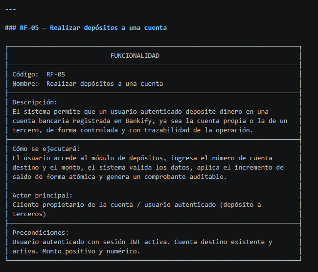

┌─────────────────────────────────────────────────────────────────────────────┐
│                           DATOS DE ENTRADA                                  │
├───────────────┬─────────────────────────────────────────────────────────────┤
│ Nombre        │ Número de cuenta                                            │
├───────────────┼─────────────────────────────────────────────────────────────┤
│ Descripción   │ Número de la cuenta bancaria destino                        │
├───────────────┼─────────────────────────────────────────────────────────────┤
│ Tipo de campo │ Texto                                                       │
├───────────────┼─────────────────────────────────────────────────────────────┤
│ Reglas /      │ Exactamente 10 dígitos numéricos. Los 2 primeros dígitos    │
│ Aplicación    │ deben corresponder a un banco registrado                    │
│               │ (01 = Bancolombia, 02 = Davivienda).                        │
│               │ Sin caracteres especiales.                                  │
├───────────────┼─────────────────────────────────────────────────────────────┤
│ Obligatorio   │ Sí                                                          │
├───────────────┼─────────────────────────────────────────────────────────────┤
│ Nombre        │ Monto                                                       │
├───────────────┼─────────────────────────────────────────────────────────────┤
│ Descripción   │ Cantidad de dinero a depositar                              │
├───────────────┼─────────────────────────────────────────────────────────────┤
│ Tipo de campo │ Numérico                                                    │
├───────────────┼─────────────────────────────────────────────────────────────┤
│ Reglas /      │ Debe ser un valor positivo mayor a cero.                    │
│ Aplicación    │ Sin caracteres especiales ni letras.                        │
├───────────────┼─────────────────────────────────────────────────────────────┤
│ Obligatorio   │ Sí                                                          │
├───────────────┼─────────────────────────────────────────────────────────────┤
│ Nombre        │ Confirmación                                                │
├───────────────┼─────────────────────────────────────────────────────────────┤
│ Descripción   │ Acción del usuario para confirmar la operación              │
├───────────────┼─────────────────────────────────────────────────────────────┤
│ Tipo de campo │ Botón                                                       │
├───────────────┼─────────────────────────────────────────────────────────────┤
│ Reglas /      │ El sistema muestra el banco confirmado antes de procesar.   │
│ Aplicación    │ El usuario debe confirmar explícitamente.                   │
├───────────────┼─────────────────────────────────────────────────────────────┤
│ Obligatorio   │ Sí                                                          │
└───────────────┴─────────────────────────────────────────────────────────────┘
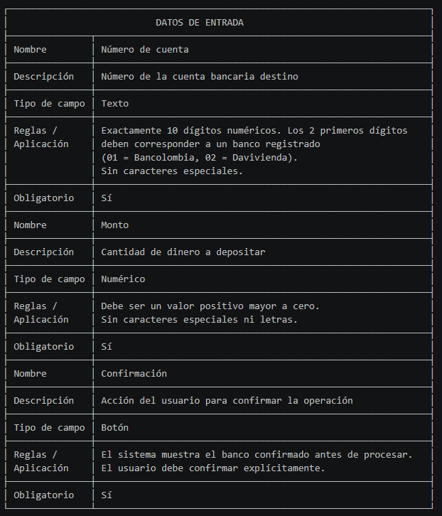

┌─────────────────────────────────────────────────────────────────────────────┐
│                           DATOS DE SALIDA                                   │
├───────────────┬─────────────────────────────────────────────────────────────┤
│ Nombre        │ Confirmación de depósito                                    │
├───────────────┼─────────────────────────────────────────────────────────────┤
│ Descripción   │ Mensaje de éxito o error al finalizar la operación          │
├───────────────┼─────────────────────────────────────────────────────────────┤
│ Tipo de campo │ Texto                                                       │
├───────────────┼─────────────────────────────────────────────────────────────┤
│ Reglas /      │ Si exitoso: muestra ID de transacción y saldo actualizado.  │
│ Aplicación    │ Si falla: mensaje claro al usuario.                         │
├───────────────┼─────────────────────────────────────────────────────────────┤
│ Obligatorio   │ Sí                                                          │
├───────────────┼─────────────────────────────────────────────────────────────┤
│ Nombre        │ Comprobante                                                 │
├───────────────┼─────────────────────────────────────────────────────────────┤
│ Descripción   │ Documento de la transacción realizada                       │
├───────────────┼─────────────────────────────────────────────────────────────┤
│ Tipo de campo │ Objeto                                                      │
├───────────────┼─────────────────────────────────────────────────────────────┤
│ Reglas /      │ Contiene: ID único, fecha/hora, cuenta destino, monto,      │
│ Aplicación    │ usuario depositante.                                        │
├───────────────┼─────────────────────────────────────────────────────────────┤
│ Obligatorio   │ Sí                                                          │
├───────────────┼─────────────────────────────────────────────────────────────┤
│ Nombre        │ Saldo actualizado                                           │
├───────────────┼─────────────────────────────────────────────────────────────┤
│ Descripción   │ Nuevo saldo de la cuenta destino                            │
├───────────────┼─────────────────────────────────────────────────────────────┤
│ Tipo de campo │ Numérico                                                    │
├───────────────┼─────────────────────────────────────────────────────────────┤
│ Reglas /      │ Solo visible para el propietario de la cuenta.              │
│ Aplicación    │                                                             │
├───────────────┼─────────────────────────────────────────────────────────────┤
│ Obligatorio   │ Sí                                                          │
└───────────────┴─────────────────────────────────────────────────────────────┘
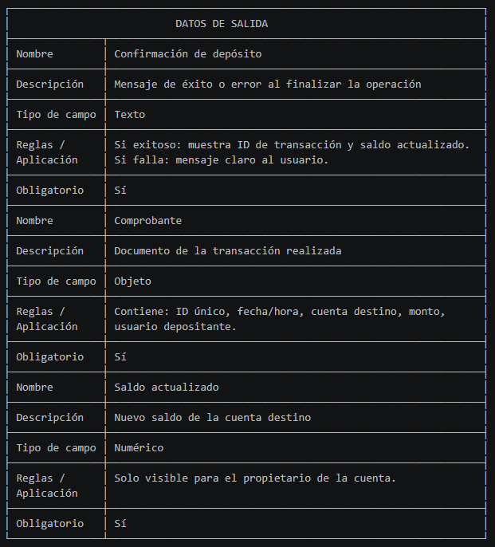

┌────────────────────────────────────────────────────────────────────────────┐
│                            FLUJO BÁSICO                                    │
├──────┬──────────┬──────────────────────────────────────────┬───────────────┤
│ Paso │ Actor    │ Descripción                              │ Excepciones   │
├──────┼──────────┼──────────────────────────────────────────┼───────────────┤
│ 1    │ Cliente  │ Accede a la sección de depósitos en la   │ —             │
│      │          │ plataforma Bankify                       │               │
├──────┼──────────┼──────────────────────────────────────────┼───────────────┤
│ 2    │ Sistema  │ Muestra el formulario de depósito con    │ —             │
│      │          │ campos: número de cuenta destino y monto │               │
├──────┼──────────┼──────────────────────────────────────────┼───────────────┤
│ 3    │ Cliente  │ Ingresa el número de cuenta destino      │ FA-01, FA-03  │
│      │          │ (propia o de tercero) y el monto a       │               │
│      │          │ depositar                                │               │
├──────┼──────────┼──────────────────────────────────────────┼───────────────┤
│ 4    │ Sistema  │ Valida el formato del número de cuenta   │ FA-01, FA-03  │
│      │          │ (10 dígitos, prefijo de banco            │               │
│      │          │ registrado) y el monto                   │               │
├──────┼──────────┼──────────────────────────────────────────┼───────────────┤
│ 5    │ Sistema  │ Verifica que la cuenta destino exista    │ FA-02         │
│      │          │ y esté activa                            │               │
├──────┼──────────┼──────────────────────────────────────────┼───────────────┤
│ 6    │ Sistema  │ Muestra el banco confirmado (derivado    │ —             │
│      │          │ de los 2 primeros dígitos) y solicita    │               │
│      │          │ confirmación al usuario                  │               │
├──────┼──────────┼──────────────────────────────────────────┼───────────────┤
│ 7    │ Cliente  │ Confirma la operación                    │ —             │
├──────┼──────────┼──────────────────────────────────────────┼───────────────┤
│ 8    │ Sistema  │ Incrementa el saldo de la cuenta destino │ FA-04         │
│      │          │ de forma atómica (con rollback ante      │               │
│      │          │ fallo)                                   │               │
├──────┼──────────┼──────────────────────────────────────────┼───────────────┤
│ 9    │ Sistema  │ Genera el comprobante y registra la      │ —             │
│      │          │ operación en el log de auditoría         │               │
├──────┼──────────┼──────────────────────────────────────────┼───────────────┤
│ 10   │ Sistema  │ Muestra el comprobante al usuario con    │ —             │
│      │          │ ID único, fecha/hora, cuenta, monto y    │               │
│      │          │ usuario depositante                      │               │
└──────┴──────────┴──────────────────────────────────────────┴───────────────┘
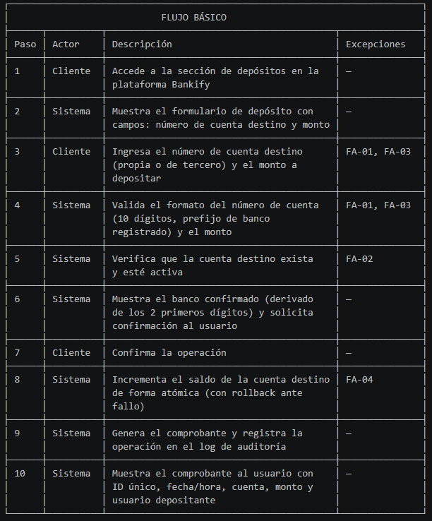

┌─────────────────────────────────────────────────────────────────────────────┐
│                            FLUJO ALTERNO                                    │
├───────┬──────────┬──────────────────────────────────────────┬───────────────┤
│ Paso  │ Actor    │ Descripción                              │ Excepciones   │
├───────┼──────────┼──────────────────────────────────────────┼───────────────┤
│ FA-01 │ Sistema  │ Si el número de cuenta no tiene 10       │ —             │
│       │          │ dígitos o el prefijo no corresponde a    │               │
│       │          │ un banco registrado, rechaza el ingreso  │               │
│       │          │ y muestra mensaje de error.              │               │
├───────┼──────────┼──────────────────────────────────────────┼───────────────┤
│ FA-02 │ Sistema  │ Si la cuenta destino no existe o está    │ —             │
│       │          │ inactiva, cancela la operación e         │               │
│       │          │ informa al usuario con mensaje           │               │
│       │          │ descriptivo.                             │               │
├───────┼──────────┼──────────────────────────────────────────┼───────────────┤
│ FA-03 │ Sistema  │ Si el monto es cero, negativo o no       │ —             │
│       │          │ numérico, bloquea el envío del           │               │
│       │          │ formulario y muestra el mensaje de       │               │
│       │          │ validación correspondiente.              │               │
├───────┼──────────┼──────────────────────────────────────────┼───────────────┤
│ FA-04 │ Sistema  │ Si ocurre un fallo durante la            │ —             │
│       │          │ actualización del saldo, realiza         │               │
│       │          │ rollback completo y notifica al usuario  │               │
│       │          │ que reintente.                           │               │
└───────┴──────────┴──────────────────────────────────────────┴───────────────┘
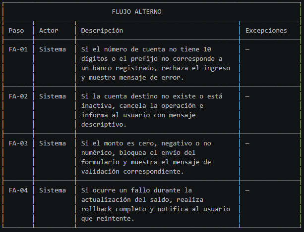

┌─────────────────────────────────────────────────────────────────────────────┐
│                        NOTAS Y COMENTARIOS                                  │
├──────────┬──────────────────────────────────────────────────────────────────┤
│ No.      │ Descripción                                                      │
├──────────┼──────────────────────────────────────────────────────────────────┤
│ NC-01    │ El depósito puede realizarlo el propietario o cualquier          │
│          │ usuario autenticado (a terceros).                                │
├──────────┼──────────────────────────────────────────────────────────────────┤
│ NC-02    │ La validación del banco por prefijo debe ejecutarse antes de     │
│          │ consultar la base de datos para reducir carga.                   │
└──────────┴──────────────────────────────────────────────────────────────────┘

┌─────────────────────────────────────────────────────────────────────────────┐
│ ANEXOS       Link Diagrama de caso de uso                                   │
├─────────────────────────────────────────────────────────────────────────────┤
│ PROTOTIPOS / MOCKUPS:     Link prototipos de flujo de navegacion            │
├─────────────────────────────────────────────────────────────────────────────┤
│ REGLAS DE NEGOCIO                                                           │
├──────────┬──────────────────────────────────────────────────────────────────┤
│ No.      │ Descripción                                                      │
├──────────┼──────────────────────────────────────────────────────────────────┤
│ RN-01    │ El número de cuenta debe tener exactamente 10 dígitos, solo      │
│          │ numéricos, sin caracteres especiales.                            │
├──────────┼──────────────────────────────────────────────────────────────────┤
│ RN-02    │ Los dos primeros dígitos del número de cuenta identifican el     │
│          │ banco (01 = Bancolombia, 02 = Davivienda).                       │
├──────────┼──────────────────────────────────────────────────────────────────┤
│ RN-03    │ Una cuenta solo es válida si pertenece a un banco registrado     │
│          │ en el sistema.                                                   │
├──────────┼──────────────────────────────────────────────────────────────────┤
│ RN-04    │ El depósito puede realizarlo el cliente propietario u otros      │
│          │ usuarios autenticados.                                           │
├──────────┼──────────────────────────────────────────────────────────────────┤
│ RN-05    │ El depósito es controlado: monto válido, cuenta activa y         │
│          │ registro auditable de la transacción.                            │
└──────────┴──────────────────────────────────────────────────────────────────┘
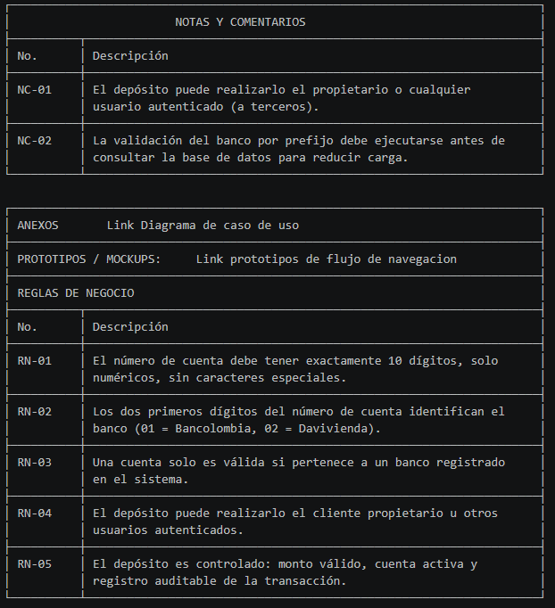

┌─────────────────────────────────────────────────────────────────────────────┐
│                           ABREVIATURAS                                      │
├─────────────┬───────────────────────────────────────────────────────────────┤
│ Abreviatura │ Significado                                                   │
├─────────────┼───────────────────────────────────────────────────────────────┤
│ RF          │ Requerimiento Funcional                                       │
├─────────────┼───────────────────────────────────────────────────────────────┤
│ JWT         │ JSON Web Token                                                │
├─────────────┼───────────────────────────────────────────────────────────────┤
│ MVP         │ Minimum Viable Product                                        │
├─────────────┼───────────────────────────────────────────────────────────────┤
│ FA          │ Flujo Alterno                                                 │
└─────────────┴───────────────────────────────────────────────────────────────┘

┌─────────────────────────────────────────────────────────────────────────────┐
│                       HISTORIAL DE REVISIÓN                                 │
├───────────────┬───────────────┬─────────────┬───────────────────────────────┤
│ Elaborado por │ Aprobado por  │ Fecha       │ Descripción y justificación   │
│               │               │             │ de cambios                    │
├───────────────┼───────────────┼─────────────┼───────────────────────────────┤
│ DOSW Company  │ —             │ Junio 2026  │ Versión inicial del           │
│               │               │             │ documento                     │
└───────────────┴───────────────┴─────────────┴───────────────────────────────┘
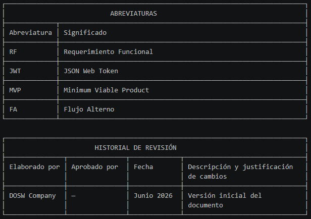

---

### RF-04 — Consultar el saldo de una cuenta

┌─────────────────────────────────────────────────────────────────────────────┐
│                           FUNCIONALIDAD                                     │
├─────────────────────────────────────────────────────────────────────────────┤
│ Código:  RF-04                                                              │
│ Nombre:  Consultar el saldo de una cuenta                                   │
├─────────────────────────────────────────────────────────────────────────────┤
│ Descripción:                                                                │
│ El sistema permite que un cliente autenticado consulte el saldo actual de   │
│ cualquiera de sus cuentas bancarias registradas en Bankify. La consulta es  │
│ de solo lectura y no modifica ningún dato.                                  │
├─────────────────────────────────────────────────────────────────────────────┤
│ Cómo se ejecutará:                                                          │
│ El cliente accede a "Mis cuentas", selecciona la cuenta a consultar y el    │
│ sistema recupera y muestra el saldo actualizado en tiempo real junto con    │
│ la información de la cuenta.                                                │
├─────────────────────────────────────────────────────────────────────────────┤
│ Actor principal:                                                            │
│ Cliente propietario de la cuenta                                            │
├─────────────────────────────────────────────────────────────────────────────┤
│ Precondiciones:                                                             │
│ Usuario autenticado con sesión JWT activa. La cuenta a consultar debe       │
│ pertenecer al cliente autenticado.                                          │
└─────────────────────────────────────────────────────────────────────────────┘
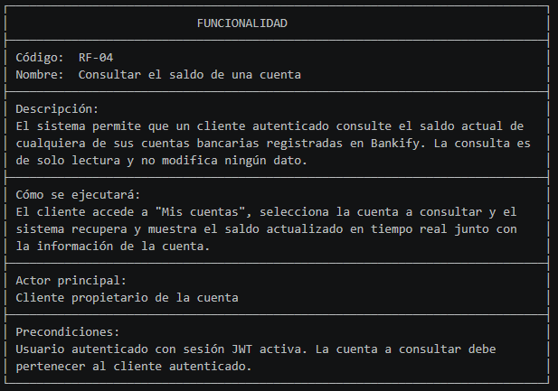

┌─────────────────────────────────────────────────────────────────────────────┐
│                           DATOS DE ENTRADA                                  │
├───────────────┬─────────────────────────────────────────────────────────────┤
│ Nombre        │ Selección de cuenta                                         │
├───────────────┼─────────────────────────────────────────────────────────────┤
│ Descripción   │ Cuenta bancaria que el cliente desea consultar              │
├───────────────┼─────────────────────────────────────────────────────────────┤
│ Tipo de campo │ Selector                                                    │
├───────────────┼─────────────────────────────────────────────────────────────┤
│ Reglas /      │ Solo se muestran las cuentas asociadas al cliente           │
│ Aplicación    │ autenticado. No puede consultar cuentas de otros clientes.  │
├───────────────┼─────────────────────────────────────────────────────────────┤
│ Obligatorio   │ Sí                                                          │
└───────────────┴─────────────────────────────────────────────────────────────┘
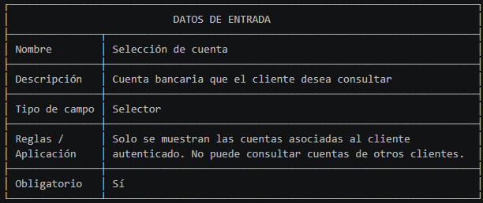

┌─────────────────────────────────────────────────────────────────────────────┐
│                           DATOS DE SALIDA                                   │
├───────────────┬─────────────────────────────────────────────────────────────┤
│ Nombre        │ Número de cuenta                                            │
├───────────────┼─────────────────────────────────────────────────────────────┤
│ Descripción   │ Número de la cuenta consultada                              │
├───────────────┼─────────────────────────────────────────────────────────────┤
│ Tipo de campo │ Texto                                                       │
├───────────────┼─────────────────────────────────────────────────────────────┤
│ Reglas /      │ Mostrado enmascarado por seguridad (ej. ******7890).        │
│ Aplicación    │                                                             │ 
├───────────────┼─────────────────────────────────────────────────────────────┤
│ Obligatorio   │ Sí                                                          │
├───────────────┼─────────────────────────────────────────────────────────────┤
│ Nombre        │ Banco asociado                                              │
├───────────────┼─────────────────────────────────────────────────────────────┤
│ Descripción   │ Nombre del banco derivado del prefijo de la cuenta          │
├───────────────┼─────────────────────────────────────────────────────────────┤
│ Tipo de campo │ Texto                                                       │
├───────────────┼─────────────────────────────────────────────────────────────┤
│ Reglas /      │ Derivado de los 2 primeros dígitos del número de cuenta.    │ 
│ Aplicación    │                                                             │
├───────────────┼─────────────────────────────────────────────────────────────┤
│ Obligatorio   │ Sí                                                          │
├───────────────┼─────────────────────────────────────────────────────────────┤
│ Nombre        │ Saldo actual                                                │
├───────────────┼─────────────────────────────────────────────────────────────┤
│ Descripción   │ Saldo vigente de la cuenta en el momento de la consulta     │
├───────────────┼─────────────────────────────────────────────────────────────┤
│ Tipo de campo │ Numérico                                                    │
├───────────────┼─────────────────────────────────────────────────────────────┤
│ Reglas /      │ Debe reflejar todas las operaciones previas.                │
│ Aplicación    │ Formato moneda colombiana (COP).                            │
├───────────────┼─────────────────────────────────────────────────────────────┤
│ Obligatorio   │ Sí                                                          │
├───────────────┼─────────────────────────────────────────────────────────────┤
│ Nombre        │ Fecha/hora                                                  │
├───────────────┼─────────────────────────────────────────────────────────────┤
│ Descripción   │ Momento exacto en que se realizó la consulta                │
├───────────────┼─────────────────────────────────────────────────────────────┤
│ Tipo de campo │ Fecha/Hora                                                  │
├───────────────┼─────────────────────────────────────────────────────────────┤
│ Reglas /      │ Zona horaria Colombia (UTC-5).                              │
│ Aplicación    │ Formato: DD/MM/AAAA HH:MM:SS.                               │
├───────────────┼─────────────────────────────────────────────────────────────┤
│ Obligatorio   │ Sí                                                          │
└───────────────┴─────────────────────────────────────────────────────────────┘
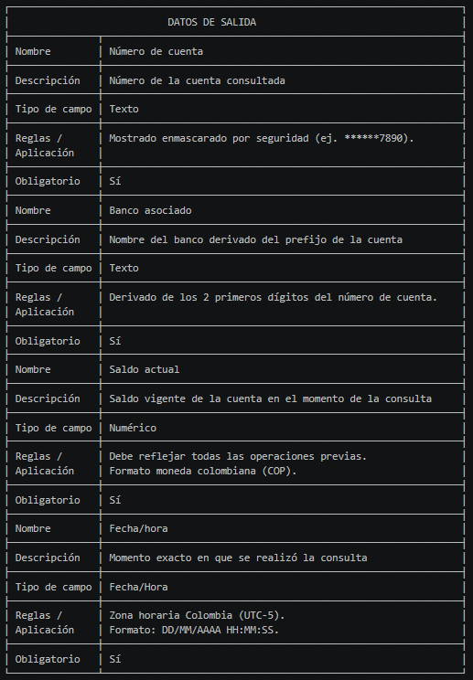

┌─────────────────────────────────────────────────────────────────────────────┐
│                            FLUJO BÁSICO                                     │
├──────┬──────────┬──────────────────────────────────────────┬────────────────┤
│ Paso │ Actor    │ Descripción                              │ Excepciones    │
├──────┼──────────┼──────────────────────────────────────────┼────────────────┤
│ 1    │ Cliente  │ Accede a la sección "Mis cuentas" o      │ —              │
│      │          │ "Consulta de saldo" en la plataforma     │                │
├──────┼──────────┼──────────────────────────────────────────┼────────────────┤
│ 2    │ Sistema  │ Lista todas las cuentas asociadas al     │ FA-01          │
│      │          │ cliente autenticado                      │                │
├──────┼──────────┼──────────────────────────────────────────┼────────────────┤
│ 3    │ Cliente  │ Selecciona la cuenta que desea consultar │ —              │
├──────┼──────────┼──────────────────────────────────────────┼────────────────┤
│ 4    │ Sistema  │ Recupera el saldo actual de la cuenta    │ FA-03          │
│      │          │ desde la base de datos                   │                │
├──────┼──────────┼──────────────────────────────────────────┼────────────────┤
│ 5    │ Sistema  │ Muestra el saldo actualizado, número     │ —              │
│      │          │ enmascarado, banco asociado y fecha/hora │                │ 
│      │          │ de la consulta                           │                │
└──────┴──────────┴──────────────────────────────────────────┴────────────────┘

┌─────────────────────────────────────────────────────────────────────────────┐
│                            FLUJO ALTERNO                                    │
├───────┬──────────┬──────────────────────────────────────────┬───────────────┤
│ Paso  │ Actor    │ Descripción                              │ Excepciones   │
├───────┼──────────┼──────────────────────────────────────────┼───────────────┤
│ FA-01 │ Sistema  │ Si el cliente no tiene cuentas           │ —             │
│       │          │ registradas, muestra mensaje             │               │
│       │          │ informativo y sugiere contactar un       │               │
│       │          │ asesor.                                  │               │
├───────┼──────────┼──────────────────────────────────────────┼───────────────┤
│ FA-02 │ Sistema  │ Si el cliente intenta acceder a una      │ —             │
│       │          │ cuenta ajena, devuelve error de          │               │
│       │          │ autorización (HTTP 403) sin revelar      │               │
│       │          │ datos de esa cuenta.                     │               │
├───────┼──────────┼──────────────────────────────────────────┼───────────────┤
│ FA-03 │ Sistema  │ Si no puede recuperar el saldo por       │ —             │
│       │          │ fallo de base de datos, informa al       │               │
│       │          │ usuario que la consulta no está          │               │
│       │          │ disponible en este momento.              │               │
└───────┴──────────┴──────────────────────────────────────────┴───────────────┘
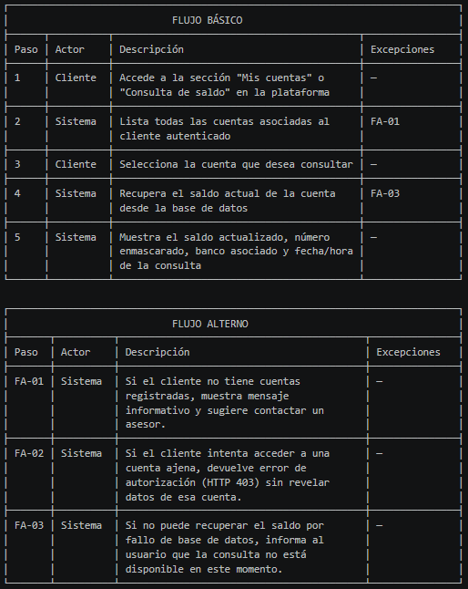

┌─────────────────────────────────────────────────────────────────────────────┐
│                        NOTAS Y COMENTARIOS                                  │
├──────────┬──────────────────────────────────────────────────────────────────┤
│ No.      │ Descripción                                                      │
├──────────┼──────────────────────────────────────────────────────────────────┤
│ NC-01    │ La consulta de saldo no genera registro en el log de             │
│          │ transacciones financieras, pero sí puede registrarse en el log   │
│          │ de auditoría de acceso para trazabilidad de seguridad.           │
└──────────┴──────────────────────────────────────────────────────────────────┘

┌─────────────────────────────────────────────────────────────────────────────┐
│ ANEXOS       Link Diagrama de caso de uso                                   │
├─────────────────────────────────────────────────────────────────────────────┤
│ PROTOTIPOS / MOCKUPS:     Link prototipos de flujo de navegacion            │
├─────────────────────────────────────────────────────────────────────────────┤
│ REGLAS DE NEGOCIO                                                           │
├──────────┬──────────────────────────────────────────────────────────────────┤
│ No.      │ Descripción                                                      │
├──────────┼──────────────────────────────────────────────────────────────────┤
│ RN-01    │ Un cliente solo puede consultar el saldo de las cuentas que le   │
│          │ pertenecen.                                                      │
├──────────┼──────────────────────────────────────────────────────────────────┤
│ RN-02    │ El saldo mostrado debe reflejar el estado actual, incluyendo     │
│          │ todos los depósitos y movimientos previos.                       │
├──────────┼──────────────────────────────────────────────────────────────────┤
│ RN-03    │ El número de cuenta debe mostrarse enmascarado (solo los         │
│          │ últimos 4 dígitos visibles).                                     │
└──────────┴──────────────────────────────────────────────────────────────────┘
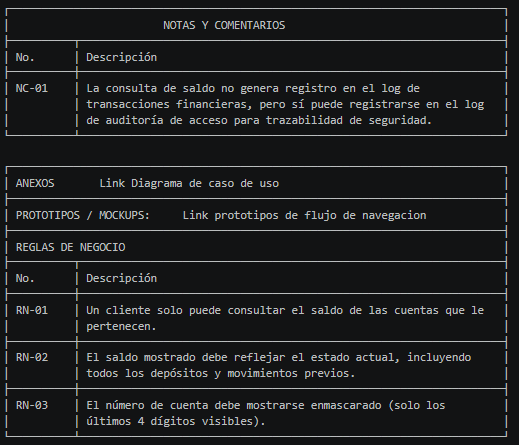

┌─────────────────────────────────────────────────────────────────────────────┐
│                           ABREVIATURAS                                      │
├─────────────┬───────────────────────────────────────────────────────────────┤
│ Abreviatura │ Significado                                                   │
├─────────────┼───────────────────────────────────────────────────────────────┤
│ RF          │ Requerimiento Funcional                                       │
├─────────────┼───────────────────────────────────────────────────────────────┤
│ JWT         │ JSON Web Token                                                │
├─────────────┼───────────────────────────────────────────────────────────────┤
│ HTTP        │ HyperText Transfer Protocol                                   │
├─────────────┼───────────────────────────────────────────────────────────────┤
│ COP         │ Peso Colombiano                                               │
├─────────────┼───────────────────────────────────────────────────────────────┤
│ FA          │ Flujo Alterno                                                 │
└─────────────┴───────────────────────────────────────────────────────────────┘

┌─────────────────────────────────────────────────────────────────────────────┐
│                       HISTORIAL DE REVISIÓN                                 │
├───────────────┬───────────────┬─────────────┬───────────────────────────────┤
│ Elaborado por │ Aprobado por  │ Fecha       │ Descripción y justificación   │
│               │               │             │ de cambios                    │
├───────────────┼───────────────┼─────────────┼───────────────────────────────┤
│ DOSW Company  │ —             │ Junio 2026  │ Versión inicial del           │
│               │               │             │ documento                     │
└───────────────┴───────────────┴─────────────┴───────────────────────────────┘
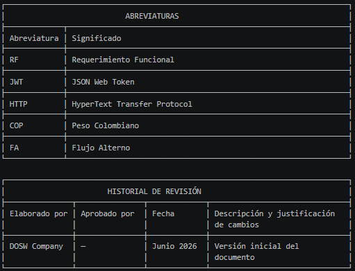

---

### RF-06 — Generar reporte tributario en PDF para el cliente

┌─────────────────────────────────────────────────────────────────────────────┐
│                           FUNCIONALIDAD                                     │
├─────────────────────────────────────────────────────────────────────────────┤
│ Código:  RF-06                                                              │
│ Nombre:  Generar reporte tributario en PDF para el cliente                  │
├─────────────────────────────────────────────────────────────────────────────┤
│ Descripción:                                                                │
│ El sistema permite que un cliente autenticado genere su declaración de      │
│ renta en formato PDF, consolidando los movimientos y saldos de todas sus    │
│ cuentas en Bankify durante el período fiscal seleccionado.                  │
├─────────────────────────────────────────────────────────────────────────────┤
│ Cómo se ejecutará:                                                          │
│ El cliente accede al módulo de reportes, selecciona el período fiscal,      │
│ confirma la generación y el sistema consolida la información, genera el     │
│ archivo PDF y lo pone disponible para descarga inmediata.                   │
├─────────────────────────────────────────────────────────────────────────────┤
│ Actor principal:                                                            │
│ Cliente propietario de las cuentas                                          │
├─────────────────────────────────────────────────────────────────────────────┤
│ Precondiciones:                                                             │
│ Usuario autenticado con sesión JWT activa. El cliente debe tener al menos   │
│ una cuenta registrada. Debe existir al menos una transacción en el          │
│ período fiscal seleccionado.                                                │
└─────────────────────────────────────────────────────────────────────────────┘
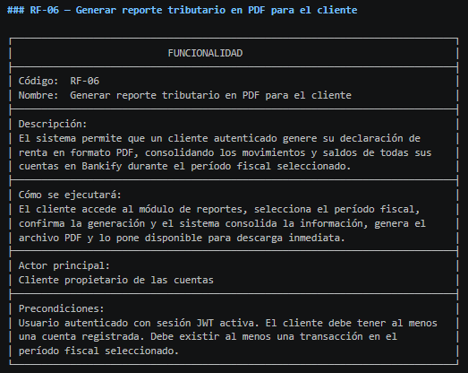

┌─────────────────────────────────────────────────────────────────────────────┐
│                           DATOS DE ENTRADA                                  │
├───────────────┬─────────────────────────────────────────────────────────────┤
│ Nombre        │ Período fiscal                                              │
├───────────────┼─────────────────────────────────────────────────────────────┤
│ Descripción   │ Año gravable para el cual se genera el reporte              │
├───────────────┼─────────────────────────────────────────────────────────────┤
│ Tipo de campo │ Selector                                                    │
├───────────────┼─────────────────────────────────────────────────────────────┤
│ Reglas /      │ No puede ser un año futuro ni anterior al inicio de         │
│ Aplicación    │ operaciones de Bankify.                                     │
├───────────────┼─────────────────────────────────────────────────────────────┤
│ Obligatorio   │ Sí                                                          │
├───────────────┼─────────────────────────────────────────────────────────────┤
│ Nombre        │ Confirmación                                                │
├───────────────┼─────────────────────────────────────────────────────────────┤
│ Descripción   │ Acción del usuario para iniciar la generación del reporte   │
├───────────────┼─────────────────────────────────────────────────────────────┤
│ Tipo de campo │ Botón                                                       │
├───────────────┼─────────────────────────────────────────────────────────────┤
│ Reglas /      │ El sistema informa al usuario el período seleccionado       │
│ Aplicación    │ antes de generar.                                           │
├───────────────┼─────────────────────────────────────────────────────────────┤
│ Obligatorio   │ Sí                                                          │
└───────────────┴─────────────────────────────────────────────────────────────┘
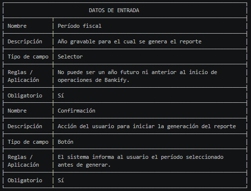

┌─────────────────────────────────────────────────────────────────────────────┐
│                           DATOS DE SALIDA                                   │
├───────────────┬─────────────────────────────────────────────────────────────┤
│ Nombre        │ Archivo PDF                                                 │
├───────────────┼─────────────────────────────────────────────────────────────┤
│ Descripción   │ Documento con la declaración de renta del cliente           │
├───────────────┼─────────────────────────────────────────────────────────────┤
│ Tipo de campo │ Archivo PDF                                                 │
├───────────────┼─────────────────────────────────────────────────────────────┤
│ Reglas /      │ Debe cumplir estándar PDF/A. Contiene: nombre, documento,   │
│ Aplicación    │ período, cuentas, saldos iniciales/finales y movimientos.   │
├───────────────┼─────────────────────────────────────────────────────────────┤
│ Obligatorio   │ Sí                                                          │
├───────────────┼─────────────────────────────────────────────────────────────┤
│ Nombre        │ Enlace de descarga                                          │
├───────────────┼─────────────────────────────────────────────────────────────┤
│ Descripción   │ URL para descargar el PDF generado                          │
├───────────────┼─────────────────────────────────────────────────────────────┤
│ Tipo de campo │ URL                                                         │
├───────────────┼─────────────────────────────────────────────────────────────┤
│ Reglas /      │ Disponible durante mínimo 30 días. Solo accesible por el    │
│ Aplicación    │ cliente propietario.                                        │
├───────────────┼─────────────────────────────────────────────────────────────┤
│ Obligatorio   │ Sí                                                          │
├───────────────┼─────────────────────────────────────────────────────────────┤
│ Nombre        │ Registro de auditoría                                       │
├───────────────┼─────────────────────────────────────────────────────────────┤
│ Descripción   │ Entrada en el log que registra la generación del reporte    │
├───────────────┼─────────────────────────────────────────────────────────────┤
│ Tipo de campo │ Log                                                         │
├───────────────┼─────────────────────────────────────────────────────────────┤
│ Reglas /      │ Contiene: cliente, fecha/hora, período fiscal generado.     │
│ Aplicación    │                                                             │
├───────────────┼─────────────────────────────────────────────────────────────┤
│ Obligatorio   │ Sí                                                          │
└───────────────┴─────────────────────────────────────────────────────────────┘
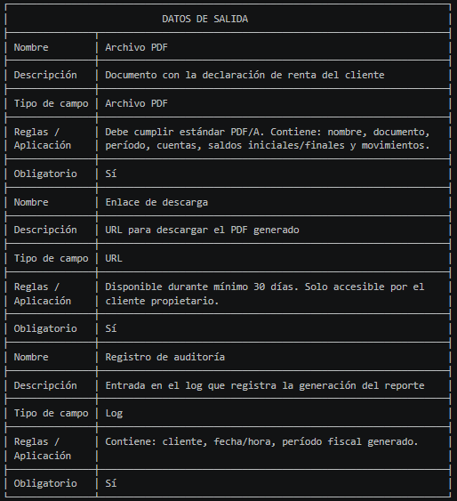

┌────────────────────────────────────────────────────────────────────────────┐
│                            FLUJO BÁSICO                                    │
├──────┬──────────┬──────────────────────────────────────────┬───────────────┤
│ Paso │ Actor    │ Descripción                              │ Excepciones   │
├──────┼──────────┼──────────────────────────────────────────┼───────────────┤
│ 1    │ Cliente  │ Accede a la sección "Reportes" o         │ —             │
│      │          │ "Declaración de renta" en la plataforma  │               │
├──────┼──────────┼──────────────────────────────────────────┼───────────────┤
│ 2    │ Sistema  │ Muestra el selector de período fiscal    │ —             │
│      │          │ (año gravable) y el botón de generación  │               │
├──────┼──────────┼──────────────────────────────────────────┼───────────────┤
│ 3    │ Cliente  │ Selecciona el año gravable y confirma    │ FA-01, FA-03  │
│      │          │ la generación del reporte                │               │
├──────┼──────────┼──────────────────────────────────────────┼───────────────┤
│ 4    │ Sistema  │ Valida que el período sea válido (no     │ FA-03         │
│      │          │ futuro, no anterior al inicio de         │               │
│      │          │ Bankify)                                 │               │
├──────┼──────────┼──────────────────────────────────────────┼───────────────┤
│ 5    │ Sistema  │ Consolida movimientos y saldos de todas  │ FA-01         │
│      │          │ las cuentas del cliente en el período    │               │
│      │          │ indicado                                 │               │
├──────┼──────────┼──────────────────────────────────────────┼───────────────┤
│ 6    │ Sistema  │ Genera el archivo PDF con la             │ FA-02         │
│      │          │ información tributaria (nombre, cuentas, │               │
│      │          │ saldos, movimientos, totales)            │               │
├──────┼──────────┼──────────────────────────────────────────┼───────────────┤
│ 7    │ Sistema  │ Registra en el log de auditoría la       │ —             │
│      │          │ generación del reporte (quién, cuándo,   │               │
│      │          │ período)                                 │               │
├──────┼──────────┼──────────────────────────────────────────┼───────────────┤
│ 8    │ Sistema  │ Presenta el enlace de descarga del PDF   │ —             │
│      │          │ al cliente                               │               │
├──────┼──────────┼──────────────────────────────────────────┼───────────────┤
│ 9    │ Cliente  │ Descarga el documento PDF                │ —             │
└──────┴──────────┴──────────────────────────────────────────┴───────────────┘
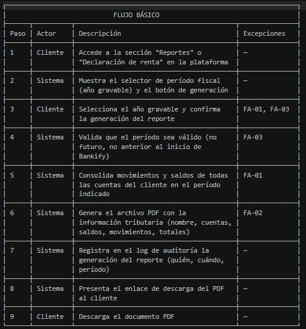

┌─────────────────────────────────────────────────────────────────────────────┐
│                            FLUJO ALTERNO                                    │
├───────┬──────────┬──────────────────────────────────────────┬───────────────┤
│ Paso  │ Actor    │ Descripción                              │ Excepciones   │
├───────┼──────────┼──────────────────────────────────────────┼───────────────┤
│ FA-01 │ Sistema  │ Si el cliente no tiene transacciones     │ —             │
│       │          │ en el período seleccionado, informa que  │               │
│       │          │ no hay datos suficientes para generar    │               │
│       │          │ el reporte.                              │               │
├───────┼──────────┼──────────────────────────────────────────┼───────────────┤
│ FA-02 │ Sistema  │ Si el sistema no puede generar el PDF    │ —             │
│       │          │ por fallo técnico, informa al usuario    │               │
│       │          │ y sugiere reintentar en unos minutos.    │               │
├───────┼──────────┼──────────────────────────────────────────┼───────────────┤
│ FA-03 │ Sistema  │ Si el período seleccionado es futuro o   │ —             │
│       │          │ anterior al inicio de operaciones de     │               │
│       │          │ Bankify, rechaza la solicitud con        │               │
│       │          │ mensaje descriptivo.                     │               │
└───────┴──────────┴──────────────────────────────────────────┴───────────────┘

┌─────────────────────────────────────────────────────────────────────────────┐
│                        NOTAS Y COMENTARIOS                                  │
├──────────┬──────────────────────────────────────────────────────────────────┤
│ No.      │ Descripción                                                      │
├──────────┼──────────────────────────────────────────────────────────────────┤
│ NC-01    │ La generación del PDF no debe superar los 5 segundos para        │
│          │ clientes con hasta 10 cuentas.                                   │
├──────────┼──────────────────────────────────────────────────────────────────┤
│ NC-02    │ El PDF es de solo lectura. Un cliente no puede acceder al        │
│          │ reporte de otro cliente.                                         │
└──────────┴──────────────────────────────────────────────────────────────────┘

┌─────────────────────────────────────────────────────────────────────────────┐
│ ANEXOS       Link Diagrama de caso de uso                                   │
├─────────────────────────────────────────────────────────────────────────────┤
│ PROTOTIPOS / MOCKUPS:     Link prototipos de flujo de navegacion            │
├─────────────────────────────────────────────────────────────────────────────┤
│ REGLAS DE NEGOCIO                                                           │
├──────────┬──────────────────────────────────────────────────────────────────┤
│ No.      │ Descripción                                                      │
├──────────┼──────────────────────────────────────────────────────────────────┤
│ RN-01    │ El cliente solo puede generar reportes de sus propias cuentas.   │
├──────────┼──────────────────────────────────────────────────────────────────┤
│ RN-02    │ El reporte PDF debe cumplir el estándar PDF/A para garantizar    │
│          │ archivado a largo plazo.                                         │
├──────────┼──────────────────────────────────────────────────────────────────┤
│ RN-03    │ El enlace de descarga debe estar disponible durante al menos     │
│          │ 30 días desde la generación.                                     │
├──────────┼──────────────────────────────────────────────────────────────────┤
│ RN-04    │ Cada generación de reporte queda registrada en el log de         │
│          │ auditoría.                                                       │
├──────────┼──────────────────────────────────────────────────────────────────┤
│ RN-05    │ No es posible generar reportes de períodos fiscales futuros.     │
└──────────┴──────────────────────────────────────────────────────────────────┘
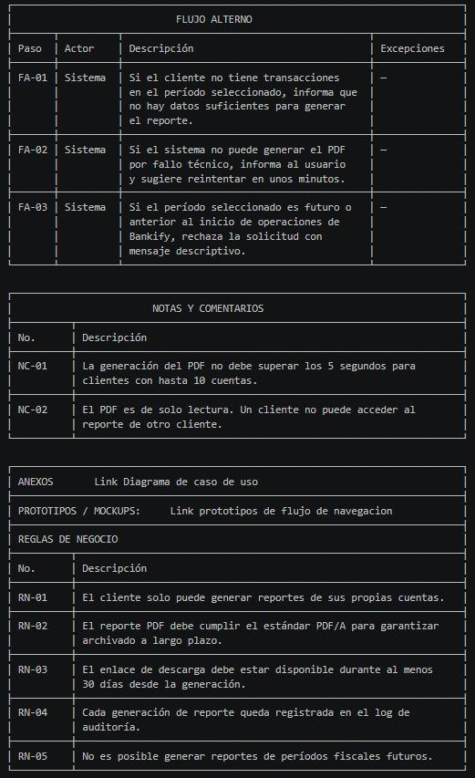

┌─────────────────────────────────────────────────────────────────────────────┐
│                           ABREVIATURAS                                      │
├─────────────┬───────────────────────────────────────────────────────────────┤
│ Abreviatura │ Significado                                                   │
├─────────────┼───────────────────────────────────────────────────────────────┤
│ RF          │ Requerimiento Funcional                                       │
├─────────────┼───────────────────────────────────────────────────────────────┤
│ JWT         │ JSON Web Token                                                │
├─────────────┼───────────────────────────────────────────────────────────────┤
│ PDF         │ Portable Document Format                                      │
├─────────────┼───────────────────────────────────────────────────────────────┤
│ PDF/A       │ PDF para archivado a largo plazo                              │
├─────────────┼───────────────────────────────────────────────────────────────┤
│ FA          │ Flujo Alterno                                                 │
├─────────────┼───────────────────────────────────────────────────────────────┤
│ DIAN        │ Dirección de Impuestos y Aduanas Nacionales                   │
└─────────────┴───────────────────────────────────────────────────────────────┘

┌─────────────────────────────────────────────────────────────────────────────┐
│                       HISTORIAL DE REVISIÓN                                 │
├───────────────┬───────────────┬─────────────┬───────────────────────────────┤
│ Elaborado por │ Aprobado por  │ Fecha       │ Descripción y justificación   │
│               │               │             │ de cambios                    │
├───────────────┼───────────────┼─────────────┼───────────────────────────────┤
│ DOSW Company  │ —             │ Junio 2026  │ Versión inicial del           │
│               │               │             │ documento                     │
└───────────────┴───────────────┴─────────────┴───────────────────────────────┘
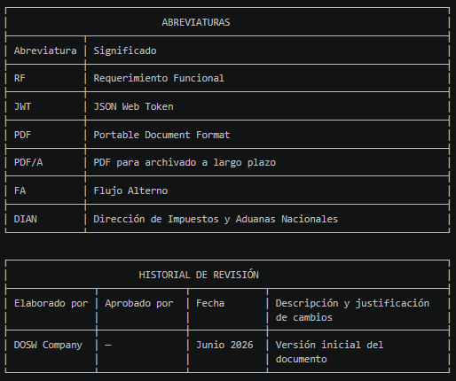

---

## 5. Análisis crítico de requerimientos

### a. ¿Identifica algún requerimiento que deba detallarse más? ¿Cuál(es)? ¿Por qué?

**RF-07 — Enviar reporte a la DIAN en formato JSON** requiere mayor detalle. No se especifica el esquema exacto del JSON que la DIAN espera recibir, ni el mecanismo de envío (¿API REST? ¿SFTP? ¿carga manual?), ni la periodicidad del envío. Sin esta información el equipo no puede implementar ni validar la integración. Es necesario revisar la documentación técnica oficial de la DIAN y consultar al Gerente Financiero antes de iniciar el desarrollo.

**RF-03 — Gestión de cuentas** también necesita más detalle: no está claro qué datos conforman una cuenta (¿solo número y banco? ¿tipo de cuenta, moneda, límites?), ni qué implica "inactivar" en términos de negocio — ¿puede una cuenta inactiva recibir depósitos? ¿puede consultarse su saldo?

### b. ¿Existen requerimientos que se contradigan entre sí? ¿Cuál(es)?

Existe una tensión entre **RF-05** y **RF-03**: RF-05 permite que cualquier usuario autenticado deposite en la cuenta de un tercero, pero RF-03 establece que el cliente puede inactivar su propia cuenta. La pregunta no resuelta es: si una cuenta está inactiva, ¿puede otro usuario depositar en ella? El caso de estudio no lo aclara. Esta ambigüedad debe resolverse con el Gerente de Operaciones antes de implementar la validación de estado en el flujo de depósitos.

### c. ¿Cuáles serían los 2 requerimientos más importantes para una primera iteración? Justifique.

**1. RF-01 — Autenticación con usuario y contraseña:** Es la puerta de entrada a todo el sistema. Sin autenticación no existe ningún flujo con control de acceso. Es el prerequisito absoluto de todos los demás requerimientos y el mayor riesgo de seguridad si se omite.

**2. RF-05 — Realizar depósitos a una cuenta:** Es el requerimiento de mayor valor de negocio en el MVP — sin depósitos la plataforma no tiene fondos y ninguna operación financiera tiene sentido. Además es el núcleo de la épica EPIC-DEPOSITO-01 ya analizada por el equipo, lo que reduce el riesgo de implementación.

### d. ¿Existe algún requerimiento que NO debería realizarse en el MVP? ¿Por qué?

**RF-07 — Generar reporte de todas las cuentas para la DIAN** no debería incluirse en el MVP. Esta funcionalidad exige coordinación con un sistema externo gubernamental, definición de un esquema JSON específico, procesos de homologación técnica y legal, y un volumen mínimo de cuentas para que tenga sentido reportar. En la etapa de MVP, donde el objetivo es validar el modelo de negocio con funcionalidades esenciales para el usuario final, este requerimiento agrega complejidad de integración sin entregar valor directo al cliente. Puede diferirse a una versión posterior una vez que la plataforma tenga usuarios y volumen de operaciones real.

---
